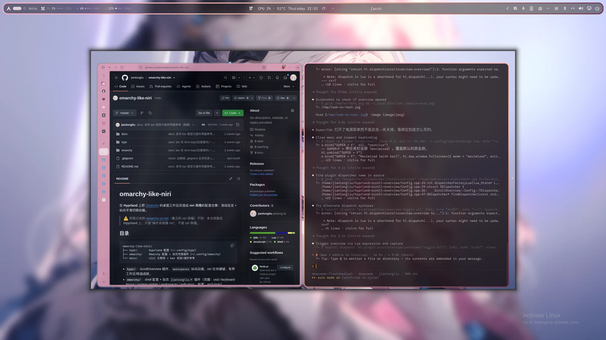
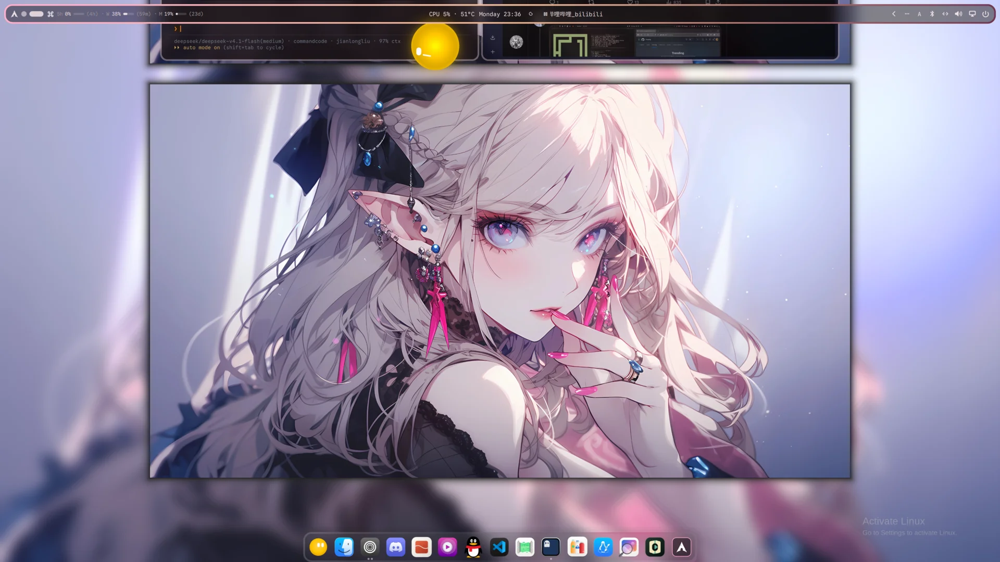

# omarchy-like-niri

在 **Hyprland** 上把 [Omarchy](https://github.com/basecamp/omarchy) 的桌面工作区改造成 **niri 风格**的配置合集：滚动总览 + 纵向平滑切换动画。

> ⚠️ 和笔记本的 [omarchy-on-niri](https://github.com/jianlongliu/omarchy-on-niri)（真正的 niri 移植）不同：本仓库跑在 **Hyprland** 上，只是"操作风格像 niri"，不是 niri 移植。

## 截图

|  |  |
| :---: | :---: |
| **滚动总览**（`SUPER + TAB`）<br>[](screenshots/scroll-overview.webp) | **纵向平铺 + 浮栏**<br>[](screenshots/tiling.webp) |
| **底栏与 Arc Dock**<br>[](screenshots/bar-dock.webp) | **锁屏**（lock-explorer）<br>[](screenshots/lock-screen.webp) |

> 点图看原图。截图里的壁纸/头像属本机私人素材，未随仓库发布；实际观感随动态配色（matugen）变化。

## 目录

```
omarchy-like-niri/
├── hypr/         Hyprland 配置（~/.config/hypr）
├── omarchy/      Omarchy 配置 + 自改克隆插件（~/.config/omarchy）
├── docs/         niri 化教程 + bar 视觉/插件参考
└── screenshots/  README 截图
```

- **`hypr/`**：ScrollOverview 插件、`workspaces` 纵向动画、niri 化快捷键、有界工作区/移窗函数。
- **`omarchy/`**：shell 配置 + 自改 `jianlongliu.*` 插件（克隆：osd / keyboard-layout / system-update / workspaces / indicators；自建：arch-logo）。
- **`docs/`**：
  | 文档 | 内容 |
  | --- | --- |
  | [`omarchy-nirification.md`](docs/omarchy-nirification.md) | niri 化安装教程（分步，每步带验证/回退）——**从这里开始** |
  | [`omarchy-visual-tweaks.md`](docs/omarchy-visual-tweaks.md) | bar 视觉定制：字号/对齐、磨砂玻璃与 layer rule、工作区胶囊、全局字体链、Gnome 风锁屏/SDDM 壁纸同步 |
  | [`omarchy-plugins.md`](docs/omarchy-plugins.md) | 插件清单与管理命令（按真实 `shell.json` 同步）+ 改第三方插件源码的本地补丁记录 |
- **`screenshots/`**：README 用的实拍截图（webp，1920×1080），见上文「截图」。

> 克隆插件位于用户目录 `~/.config/omarchy/plugins/`，不在系统包内，`omarchy update` **不会覆盖**它们。纳入 git 是用于**版本回退 + 备份/迁移**，并非防 update 覆盖（那本就不需要）。

## 安装

按 [`docs/omarchy-nirification.md`](docs/omarchy-nirification.md) 文首的「执行顺序总览」逐条执行，每步带验证与回退。目标机需是 **Omarchy**（配置依赖 `o.*` / `hl.*` 助手），否则不适用。

### 交给 AI agent 执行

将以下提示词交给 AI agent 即可安装（教程已在仓库内，clone 即自包含）：

```
按 docs/omarchy-nirification.md 的「执行顺序总览」逐步安装 niri 化配置。
要求：
1. 每步先读对应章节再动手，做完一步用文档里的「验证」确认过了再下一步。
2. 步骤 1-7 是核心（插件安装、插件配置、自加载、纵向动画、快捷键、有界工作区、有界移窗）；8 可选（nautilus 浮动）；9 总验证。
3. 每改一个 hypr 配置文件先备份，出问题按该步骤「回退」还原。
4. 全部完成后跑一遍「验证」章节，hyprctl configerrors 必须为空。
5. 目标机必须是 Omarchy（依赖 o.*/hl.* 助手），否则不适用。
```

## 说明

- 配置与文档由 AI agent 生成/整理，改动含 AI 协助调参、排障。
- 各插件版权归原作者；自改 `jianlongliu.*` 克隆插件基于 Omarchy 内建插件。
- 改动历史见 `hypr/CHANGELOG.md` 与 `omarchy/CHANGELOG.md`。
- `omarchy/lock-avatar.png`：锁屏头像样例（lock-explorer 探测的首选路径），拷到 `~/.config/omarchy/lock-avatar.png` 即被读取；不想要就删，锁屏回落显示用户首字母。
